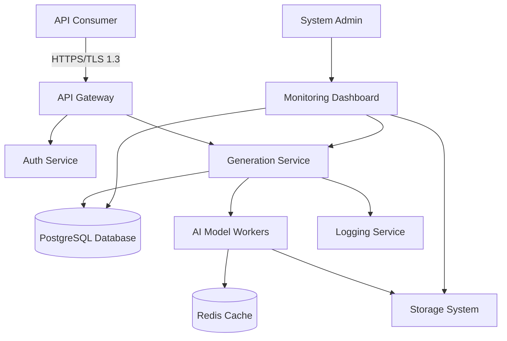

# Video-Lyric-Image-and-Music Generator API - Design Document

## 1. System Context



## 2. Tech Stack

| Layer | Recommended Choice | Alternatives | Rationale |
|-------|-------------------|--------------|-----------|
| Language | Python 3.11 | Node.js, Go | Excellent AI/ML ecosystem, strong async support for streaming |
| Framework | FastAPI | Flask, Express.js | Native async support, automatic OpenAPI docs, built-in validation |
| Auth | JWT (RS256) with PyJWT | OAuth2, API Keys | Standardized, secure, fits with JWT requirement |
| Database | PostgreSQL 15 | MySQL, MongoDB | ACID compliance, good for structured request metadata |
| Cache | Redis 7 | Memcached, Etcd | Excellent for queuing and temporary storage |
| AI Models | HuggingFace Transformers + Diffusion Models | TensorFlow, PyTorch native | Pre-trained models readily available, modular architecture |
| Storage | Local File System (encrypted) | MinIO, NFS | Cost-effective at small scale, meets requirements |
| Containerization | Docker | Podman, LXC | Industry standard, good orchestration support |
| Orchestration | Docker Compose (dev), Kubernetes (prod) | Nomad, ECS | Scalable, supports horizontal scaling needs |
| Monitoring | Prometheus + Grafana | Datadog, New Relic | Free tier sufficient, good open-source support |

## 3. Data Model

```sql
CREATE TABLE api_keys (
    id UUID PRIMARY KEY DEFAULT gen_random_uuid(),
    key_hash TEXT NOT NULL UNIQUE,
    consumer_name VARCHAR(255) NOT NULL,
    is_active BOOLEAN DEFAULT TRUE,
    created_at TIMESTAMP WITH TIME ZONE DEFAULT NOW(),
    expires_at TIMESTAMP WITH TIME ZONE
);

CREATE INDEX idx_api_keys_key_hash ON api_keys(key_hash);
CREATE INDEX idx_api_keys_consumer_name ON api_keys(consumer_name);

CREATE TYPE generation_type AS ENUM ('video', 'lyrics', 'image', 'music');
CREATE TYPE generation_status AS ENUM ('queued', 'processing', 'completed', 'failed', 'timeout');

CREATE TABLE generation_requests (
    id UUID PRIMARY KEY DEFAULT gen_random_uuid(),
    api_key_id UUID NOT NULL REFERENCES api_keys(id),
    type generation_type NOT NULL,
    status generation_status NOT NULL DEFAULT 'queued',
    prompt TEXT,
    style TEXT,
    duration INTEGER, -- in seconds
    resolution TEXT, -- e.g., "1920x1080"
    genre TEXT,
    tempo INTEGER, -- in BPM
    length INTEGER, -- in seconds
    parameters JSONB, -- additional custom parameters
    created_at TIMESTAMP WITH TIME ZONE DEFAULT NOW(),
    started_at TIMESTAMP WITH TIME ZONE,
    completed_at TIMESTAMP WITH TIME ZONE,
    error_message TEXT,
    result_url TEXT,
    estimated_completion TIMESTAMP WITH TIME ZONE
);

CREATE INDEX idx_generation_requests_api_key_id ON generation_requests(api_key_id);
CREATE INDEX idx_generation_requests_type_status ON generation_requests(type, status);
CREATE INDEX idx_generation_requests_created_at ON generation_requests(created_at DESC);

CREATE TABLE rate_limit_buckets (
    api_key_id UUID NOT NULL REFERENCES api_keys(id),
    bucket_start TIMESTAMP WITH TIME ZONE NOT NULL,
    request_count INTEGER DEFAULT 0,
    PRIMARY KEY (api_key_id, bucket_start)
);

CREATE TABLE system_metrics (
    id SERIAL PRIMARY KEY,
    metric_name VARCHAR(100) NOT NULL,
    metric_value NUMERIC NOT NULL,
    recorded_at TIMESTAMP WITH TIME ZONE DEFAULT NOW()
);

CREATE INDEX idx_system_metrics_name_time ON system_metrics(metric_name, recorded_at);
```

## 4. API Surface

| Method | Path | Description |
|--------|------|-------------|
| POST | `/generate/video` | Generate video from text prompt with style and duration |
| POST | `/generate/lyrics` | Generate song lyrics based on genre and theme |
| POST | `/generate/image` | Create image from text description and resolution |
| POST | `/generate/music` | Compose music from genre, instruments, and tempo |
| GET | `/status/{request_id}` | Get status of generation request |
| POST | `/auth/token` | Obtain JWT token for API access |
| GET | `/health` | Health check endpoint |
| GET | `/metrics` | System metrics for monitoring |
| POST | `/webhook/callback` | Receive notifications from AI workers |

## 5. Security Decisions

| Decision | Implementation | Rationale |
|----------|----------------|-----------|
| Authentication | JWT tokens with RS256 signing | Industry standard, secure, stateless |
| Authorization | Role-based access control with scopes | Fine-grained control over endpoints |
| Transport Encryption | Mandatory TLS 1.3 | Meets modern security standards |
| Data at Rest | AES-256 encryption for temporary files | Requirement compliance |
| Input Validation | Pydantic models with strict validation | Protection against injection attacks |
| Rate Limiting | Sliding window algorithm per API key | Fair usage, DoS protection |
| Credential Storage | Argon2 hashing for API keys | Resistant to brute-force attacks |
| Audit Logging | Structured logging with request metadata | Compliance with NFR-04 |
| CORS Policy | Restricted to trusted origins only | Prevents unauthorized cross-origin requests |

## 6. Folder Structure

```
video-lyric-image-music-generator/
├── app/
│   ├── __init__.py
│   ├── main.py                 # FastAPI app initialization
│   ├── config/
│   │   ├── __init__.py
│   │   └── settings.py         # Configuration management
│   ├── api/
│   │   ├── __init__.py
│   │   ├── routes/
│   │   │   ├── __init__.py
│   │   │   ├── generation.py   # Generation endpoints
│   │   │   ├── auth.py         # Authentication endpoints
│   │   │   └── health.py       # Health check endpoints
│   │   ├── dependencies.py     # FastAPI dependencies
│   │   └── middleware/
│   │       ├── __init__.py
│   │       └── rate_limit.py   # Rate limiting middleware
│   ├── core/
│   │   ├── __init__.py
│   │   ├── security.py         # JWT handling, password hashing
│   │   └── database.py         # Database session management
│   ├── models/
│   │   ├── __init__.py
│   │   ├── domain/
│   │   │   ├── __init__.py
│   │   │   ├── generation.py   # Domain models for generation
│   │   │   └── auth.py         # Domain models for auth
│   │   └── schemas/
│   │       ├── __init__.py
│   │       └── api_models.py   # Pydantic schemas
│   ├── services/
│   │   ├── __init__.py
│   │   ├── generation_service.py
│   │   ├── auth_service.py
│   │   └── queue_service.py
│   ├── utils/
│   │   ├── __init__.py
│   │   ├── streaming.py        # Streaming utilities
│   │   └── file_storage.py     # Secure file storage
│   └── workers/
│       ├── __init__.py
│       ├── base_worker.py
│       ├── video_worker.py
│       ├── lyrics_worker.py
│       ├── image_worker.py
│       └── music_worker.py
├── tests/
│   ├── __init__.py
│   ├── conftest.py
│   ├── test_api/
│   ├── test_services/
│   └── test_workers/
├── alembic/                    # Database migrations
├── scripts/
│   ├── start_server.sh
│   └── run_workers.sh
├── docker/
│   ├── Dockerfile
│   └── docker-compose.yml
├── docs/
│   └── openapi.json
├── .env.example
├── requirements.txt
└── README.md
```