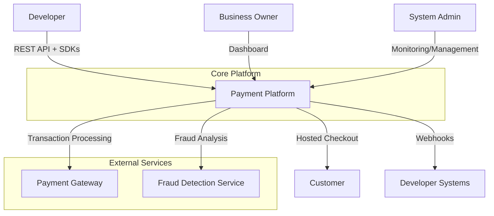

# Developer-First Payments Platform Design

## 1. System Context



## 2. Tech Stack

| Component | Primary Choice | Alternatives | Rationale |
|-----------|----------------|--------------|-----------|
| Backend Framework | Node.js + Express | Django, Spring Boot, Laravel | JavaScript ecosystem matches SDK requirements, excellent for REST APIs |
| Database | PostgreSQL | MySQL, MongoDB | ACID compliance needed for financial data, good JSON support |
| Real-time Dashboard | WebSocket + Redis | Socket.IO, Pusher | Enables real-time metrics updates with scalable pub/sub |
| Cache | Redis | Memcached | Required for session management and real-time features |
| Message Queue | RabbitMQ | Apache Kafka, AWS SQS | Handles webhook retries and async processing |
| Containerization | Docker | Podman | Standard for deployment consistency |
| Orchestration | Kubernetes | Docker Swarm | Required for horizontal scaling |
| API Documentation | Swagger/OpenAPI | Postman, Stoplight | Industry standard for REST APIs |
| Monitoring | Prometheus + Grafana | Datadog, New Relic | Open-source, good for budget-conscious deployment |
| CI/CD | GitHub Actions | GitLab CI, Jenkins | Integrates well with common development workflows |
| Cloud Provider | AWS | GCP, Azure | Extensive payment service integrations |
| CDN | Cloudflare | AWS CloudFront, Akamai | Global presence important for emerging markets |
| Fraud Detection | Sift/Similar | Stripe Radar, Riskified | Specialized third-party service meets requirements |

## 3. Data Model

```sql
-- Merchants/businesses using the platform
CREATE TABLE merchants (
    id UUID PRIMARY KEY DEFAULT gen_random_uuid(),
    name VARCHAR(255) NOT NULL,
    email VARCHAR(255) UNIQUE NOT NULL,
    api_key VARCHAR(255) UNIQUE NOT NULL,
    api_key_hash VARCHAR(255) NOT NULL,
    api_key_salt VARCHAR(255) NOT NULL,
    public_key VARCHAR(255) UNIQUE NOT NULL,
    webhook_url TEXT,
    status VARCHAR(50) DEFAULT 'active',
    created_at TIMESTAMP WITH TIME ZONE DEFAULT CURRENT_TIMESTAMP,
    updated_at TIMESTAMP WITH TIME ZONE DEFAULT CURRENT_TIMESTAMP
);
CREATE INDEX idx_merchants_api_key ON merchants(api_key);
CREATE INDEX idx_merchants_email ON merchants(email);

-- Customer records for recurring billing
CREATE TABLE customers (
    id UUID PRIMARY KEY DEFAULT gen_random_uuid(),
    merchant_id UUID NOT NULL REFERENCES merchants(id),
    email VARCHAR(255),
    name VARCHAR(255),
    phone VARCHAR(50),
    metadata JSONB,
    created_at TIMESTAMP WITH TIME ZONE DEFAULT CURRENT_TIMESTAMP,
    updated_at TIMESTAMP WITH TIME ZONE DEFAULT CURRENT_TIMESTAMP,
    FOREIGN KEY (merchant_id) REFERENCES merchants(id) ON DELETE CASCADE
);
CREATE INDEX idx_customers_merchant ON customers(merchant_id);
CREATE INDEX idx_customers_email ON customers(email);

-- Subscription plans
CREATE TABLE plans (
    id UUID PRIMARY KEY DEFAULT gen_random_uuid(),
    merchant_id UUID NOT NULL REFERENCES merchants(id),
    name VARCHAR(255) NOT NULL,
    description TEXT,
    amount_cents INTEGER NOT NULL,
    currency VARCHAR(3) NOT NULL,
    interval VARCHAR(20) NOT NULL CHECK (interval IN ('day', 'week', 'month', 'year')),
    interval_count INTEGER DEFAULT 1,
    trial_period_days INTEGER DEFAULT 0,
    metadata JSONB,
    status VARCHAR(50) DEFAULT 'active',
    created_at TIMESTAMP WITH TIME ZONE DEFAULT CURRENT_TIMESTAMP,
    updated_at TIMESTAMP WITH TIME ZONE DEFAULT CURRENT_TIMESTAMP,
    FOREIGN KEY (merchant_id) REFERENCES merchants(id) ON DELETE CASCADE
);
CREATE INDEX idx_plans_merchant ON plans(merchant_id);
CREATE INDEX idx_plans_status ON plans(status);

-- Customer subscriptions
CREATE TABLE subscriptions (
    id UUID PRIMARY KEY DEFAULT gen_random_uuid(),
    merchant_id UUID NOT NULL REFERENCES merchants(id),
    customer_id UUID NOT NULL REFERENCES customers(id),
    plan_id UUID NOT NULL REFERENCES plans(id),
    status VARCHAR(50) NOT NULL CHECK (status IN ('active', 'paused', 'cancelled', 'past_due')),
    current_period_start TIMESTAMP WITH TIME ZONE NOT NULL,
    current_period_end TIMESTAMP WITH TIME ZONE NOT NULL,
    cancel_at_period_end BOOLEAN DEFAULT FALSE,
    canceled_at TIMESTAMP WITH TIME ZONE,
    metadata JSONB,
    created_at TIMESTAMP WITH TIME ZONE DEFAULT CURRENT_TIMESTAMP,
    updated_at TIMESTAMP WITH TIME ZONE DEFAULT CURRENT_TIMESTAMP,
    FOREIGN KEY (merchant_id) REFERENCES merchants(id) ON DELETE CASCADE,
    FOREIGN KEY (customer_id) REFERENCES customers(id) ON DELETE CASCADE,
    FOREIGN KEY (plan_id) REFERENCES plans(id) ON DELETE CASCADE
);
CREATE INDEX idx_subscriptions_merchant ON subscriptions(merchant_id);
CREATE INDEX idx_subscriptions_customer ON subscriptions(customer_id);
CREATE INDEX idx_subscriptions_plan ON subscriptions(plan_id);
CREATE INDEX idx_subscriptions_status ON subscriptions(status);

-- Payment transactions
CREATE TABLE transactions (
    id UUID PRIMARY KEY DEFAULT gen_random_uuid(),
    merchant_id UUID NOT NULL REFERENCES merchants(id),
    customer_id UUID REFERENCES customers(id),
    subscription_id UUID REFERENCES subscriptions(id),
    amount_cents INTEGER NOT NULL,
    currency VARCHAR(3) NOT NULL,
    usd_amount_cents INTEGER,
    type VARCHAR(50) NOT NULL CHECK (type IN ('payment', 'refund', 'payout')),
    status VARCHAR(50) NOT NULL CHECK (status IN ('pending', 'success', 'failed', 'canceled')),
    payment_method_type VARCHAR(50),
    payment_gateway_id VARCHAR(255),
    gateway_transaction_id VARCHAR(255),
    description TEXT,
    metadata JSONB,
    fraud_score DECIMAL(5,4),
    fraud_flags JSONB,
    processed_at TIMESTAMP WITH TIME ZONE,
    created_at TIMESTAMP WITH TIME ZONE DEFAULT CURRENT_TIMESTAMP,
    updated_at TIMESTAMP WITH TIME ZONE DEFAULT CURRENT_TIMESTAMP,
    FOREIGN KEY (merchant_id) REFERENCES merchants(id) ON DELETE CASCADE,
    FOREIGN KEY (customer_id) REFERENCES customers(id) ON DELETE SET NULL,
    FOREIGN KEY (subscription_id) REFERENCES subscriptions(id) ON DELETE SET NULL
);
CREATE INDEX idx_transactions_merchant ON transactions(merchant_id);
CREATE INDEX idx_transactions_customer ON transactions(customer_id);
CREATE INDEX idx_transactions_subscription ON transactions(subscription_id);
CREATE INDEX idx_transactions_status ON transactions(status);
CREATE INDEX idx_transactions_created_at ON transactions(created_at);

-- Payout configurations
CREATE TABLE payout_schedules (
    id UUID PRIMARY KEY DEFAULT gen_random_uuid(),
    merchant_id UUID NOT NULL REFERENCES merchants(id),
    recipient_account JSONB NOT NULL,
    frequency VARCHAR(20) NOT NULL CHECK (frequency IN ('daily', 'weekly', 'monthly')),
    last_payout_date TIMESTAMP WITH TIME ZONE,
    next_payout_date TIMESTAMP WITH TIME ZONE,
    status VARCHAR(50) DEFAULT 'active',
    created_at TIMESTAMP WITH TIME ZONE DEFAULT CURRENT_TIMESTAMP,
    updated_at TIMESTAMP WITH TIME ZONE DEFAULT CURRENT_TIMESTAMP,
    FOREIGN KEY (merchant_id) REFERENCES merchants(id) ON DELETE CASCADE
);
CREATE INDEX idx_payout_schedules_merchant ON payout_schedules(merchant_id);
CREATE INDEX idx_payout_schedules_next_date ON payout_schedules(next_payout_date);

-- Currency exchange rates
CREATE TABLE exchange_rates (
    id UUID PRIMARY KEY DEFAULT gen_random_uuid(),
    from_currency VARCHAR(3) NOT NULL,
    to_currency VARCHAR(3) NOT NULL,
    rate DECIMAL(20,10) NOT NULL,
    fetched_at TIMESTAMP WITH TIME ZONE DEFAULT CURRENT_TIMESTAMP
);
CREATE UNIQUE INDEX idx_exchange_rates_unique ON exchange_rates(from_currency, to_currency);
CREATE INDEX idx_exchange_rates_fetched_at ON exchange_rates(fetched_at);

-- Webhook delivery tracking
CREATE TABLE webhook_deliveries (
    id UUID PRIMARY KEY DEFAULT gen_random_uuid(),
    merchant_id UUID NOT NULL REFERENCES merchants(id),
    transaction_id UUID REFERENCES transactions(id),
    url TEXT NOT NULL,
    payload JSONB NOT NULL,
    headers JSONB,
    status VARCHAR(50) NOT NULL CHECK (status IN ('pending', 'success', 'failed')),
    response_code INTEGER,
    response_body TEXT,
    attempt_number INTEGER DEFAULT 1,
    max_attempts INTEGER DEFAULT 5,
    next_attempt_at TIMESTAMP WITH TIME ZONE,
    completed_at TIMESTAMP WITH TIME ZONE,
    created_at TIMESTAMP WITH TIME ZONE DEFAULT CURRENT_TIMESTAMP,
    FOREIGN KEY (merchant_id) REFERENCES merchants(id) ON DELETE CASCADE,
    FOREIGN KEY (transaction_id) REFERENCES transactions(id) ON DELETE CASCADE
);
CREATE INDEX idx_webhook_deliveries_merchant ON webhook_deliveries(merchant_id);
CREATE INDEX idx_webhook_deliveries_status ON webhook_deliveries(status);
CREATE INDEX idx_webhook_deliveries_next_attempt ON webhook_deliveries(next_attempt_at);

-- Audit logging
CREATE TABLE audit_logs (
    id UUID PRIMARY KEY DEFAULT gen_random_uuid(),
    actor_type VARCHAR(50) NOT NULL,
    actor_id UUID,
    action VARCHAR(100) NOT NULL,
    resource_type VARCHAR(100),
    resource_id UUID,
    metadata JSONB,
    ip_address INET,
    user_agent TEXT,
    created_at TIMESTAMP WITH TIME ZONE DEFAULT CURRENT_TIMESTAMP
);
CREATE INDEX idx_audit_logs_actor ON audit_logs(actor_type, actor_id);
CREATE INDEX idx_audit_logs_action ON audit_logs(action);
CREATE INDEX idx_audit_logs_resource ON audit_logs(resource_type, resource_id);
CREATE INDEX idx_audit_logs_created_at ON audit_logs(created_at);
```

## 4. API Surface

| Method | Path | Description |
|--------|------|-------------|
| POST | /v1/payments | Create a new payment intent |
| GET | /v1/payments/:id | Retrieve a payment by ID |
| POST | /v1/payments/:id/refund | Refund a payment |
| POST | /v1/plans | Create a new subscription plan |
| GET | /v1/plans | List all subscription plans |
| GET | /v1/plans/:id | Retrieve a subscription plan |
| PUT | /v1/plans/:id | Update a subscription plan |
| DELETE | /v1/plans/:id | Delete a subscription plan |
| POST | /v1/customers | Create a new customer |
| GET | /v1/customers | List customers |
| GET | /v1/customers/:id | Retrieve a customer |
| PUT | /v1/customers/:id | Update a customer |
| POST | /v1/subscriptions | Create a new subscription |
| GET | /v1/subscriptions | List subscriptions |
| GET | /v1/subscriptions/:id | Retrieve a subscription |
| POST | /v1/subscriptions/:id/cancel | Cancel a subscription |
| POST | /v1/subscriptions/:id/change-plan | Change subscription plan |
| POST | /v1/webhooks/test | Send a test webhook |
| GET | /v1/balance | Get account balance |
| GET | /v1/payouts/schedule | Get payout schedule |
| POST | /v1/payouts/schedule | Configure payout schedule |
| GET | /v1/transactions | List transactions |
| GET | /v1/metrics/dashboard | Get dashboard metrics |
| POST | /v1/checkout/sessions | Create a hosted checkout session |
| GET | /v1/checkout/sessions/:id | Retrieve a checkout session |

## 5. Security Decisions

| Decision | Implementation | Rationale |
|----------|----------------|-----------|
| API Authentication | HMAC with rotating keys | Protects against replay attacks and key compromise |
| Data Encryption | AES-256 for sensitive fields | Meets PCI-DSS requirements for data-at-rest |
| HTTPS Only | TLS 1.2+ enforced globally | Ensures data-in-transit protection |
| PCI Compliance | Tokenization + third-party gateway | Offloads card data handling to compliant providers |
| Rate Limiting | 1000 requests/hour per API key | Prevents abuse and DoS attacks |
| Input Validation | Strict schema validation on all inputs | Prevents injection attacks |
| Audit Logging | Comprehensive logging of all financial actions | Meets regulatory requirements and enables forensic analysis |
| CORS Policy | Restricted to registered domains only | Prevents unauthorized web clients from accessing API |
| Fraud Detection | Integrated third-party service with score-based blocking | Specialized expertise required for effective fraud prevention |
| Session Management | Short-lived JWT tokens with refresh | Balances UX with security for dashboard access |

## 6. Folder Structure

```
payment-platform/
├── src/
│   ├── api/
│   │   ├── v1/
│   │   │   ├── controllers/
│   │   │   ├── middleware/
│   │   │   ├── routes/
│   │   │   └── validators/
│   │   └── index.js
│   ├── services/
│   │   ├── payment-gateway/
│   │   ├── fraud-detection/
│   │   ├── billing-engine/
│   │   ├── webhook-delivery/
│   │   └── currency-conversion/
│   ├── models/
│   │   ├── merchant.js
│   │   ├── customer.js
│   │   ├── subscription.js
│   │   ├── transaction.js
│   │   └── payout-schedule.js
│   ├── utils/
│   │   ├── crypto.js
│   │   ├── logger.js
│   │   ├── validator.js
│   │   └── helpers.js
│   ├── config/
│   │   ├── database.js
│   │   ├── redis.js
│   │   └── environment.js
│   └── app.js
├── sdk/
│   ├── javascript/
│   ├── python/
│   ├── java/
│   ├── php/
│   ├── ruby/
│   └── go/
├── docs/
│   ├── api-reference/
│   ├── sdk-guides/
│   └── integration-examples/
├── migrations/
├── tests/
│   ├── unit/
│   ├── integration/
│   └── e2e/
├── scripts/
├── docker/
├── kubernetes/
├── .env.example
├── package.json
└── README.md
```